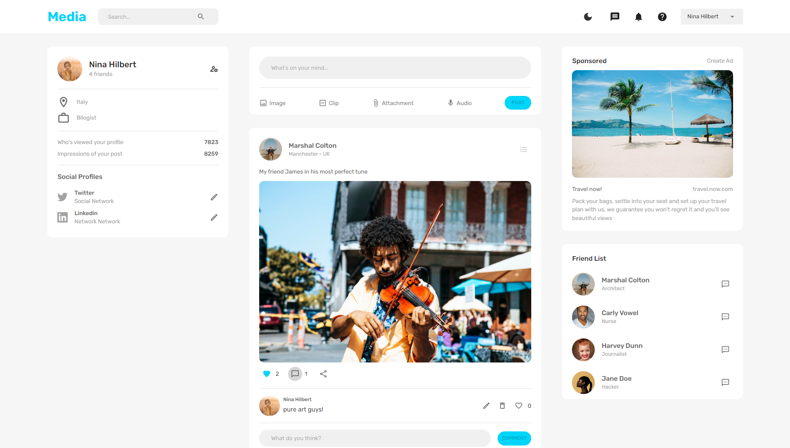

<h2 align="center">Full Stack MERN Responsive Social Media App </h2>

### 📋 About the project

Como uma rede social real, você pode criar/editar/deletar posts, 
além de criar/editar/deletar comentários, dar like em posts e
comentários também é possível e é claro adicionar e remover amigos,
ao quais esses tem as suas páginas de perfil contendo apenas suas próprias publicações.
Ou fique na página inicial (feed) e veja todos os posts.

É permitido fazer upload de imagens tanto para sua foto de perfil quanto para sua postagem.
Em caso de insatisfação com a sua conta, saiba que você pode editar-lá ou mesmo deleta-lá.

Para deixá-lo mais completo, funcionalidades que serão adicionadas em breve:
notificações e bate-papo em tempo real, 
aprovação ou recusa de convite de amizade 
e talvez um dashboard básico.

---

    

### Para uma melhor experiência, teste você mesmo - [Social Media App](https://abms-socialmedia-app.onrender.com)
---
### 🚀 Technologies

- [React.js](https://reactjs.org/)
- [React Router DOM](https://www.npmjs.com/package/react-router-dom)
- [Redux](https://react-redux.js.org/)
- [redux-persist](https://www.npmjs.com/package/redux-persist)
- [react-dropzone](https://react-dropzone.js.org/)
- [react-spinners](https://www.davidhu.io/react-spinners/)
- [MUI](https://mui.com/)
- [MUI-Icons](https://mui.com/material-ui/material-icons/)
- [formik](https://formik.org/)
- [yup](https://www.npmjs.com/package/yup)
 

- [Node.js](https://nodejs.org/en/)
- [MongoDB](https://www.mongodb.com/cloud)
- [mongoose](https://mongoosejs.com/)
- [Express](https://expressjs.com/pt-br/)
- [bcrypt](https://www.npmjs.com/package/bcrypt)
- [cors](https://www.npmjs.com/package/cors)
- [dotenv](https://www.npmjs.com/package/dotenv)
- [firebase-admin](https://www.npmjs.com/package/firebase-admin)
- [gridfs-stream](https://www.npmjs.com/package/gridfs-stream)
- [helmet](https://www.npmjs.com/package/helmet)
- [morgan](https://www.npmjs.com/package/morgan)
- [multer](https://www.npmjs.com/package/multer)
- [multer-gridfs-storage](https://www.npmjs.com/package/multer-gridfs-storage)
- [JWT](https://www.npmjs.com/package/jsonwebtoken)

---
### 👉 [See my Linkedin](https://www.linkedin.com/in/alisson-modesto-fullstack-developer/)
